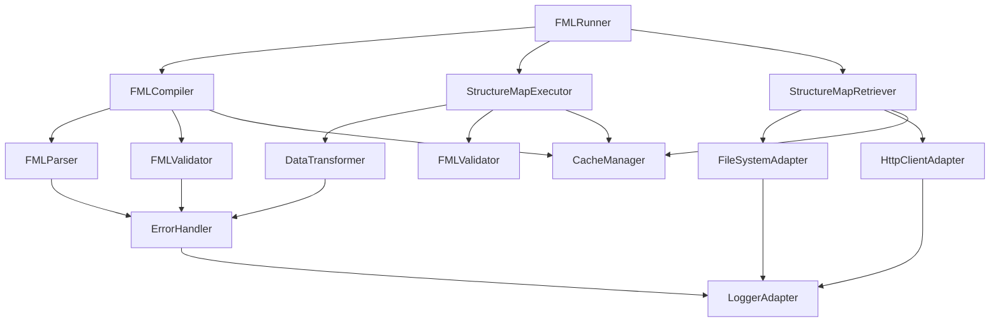
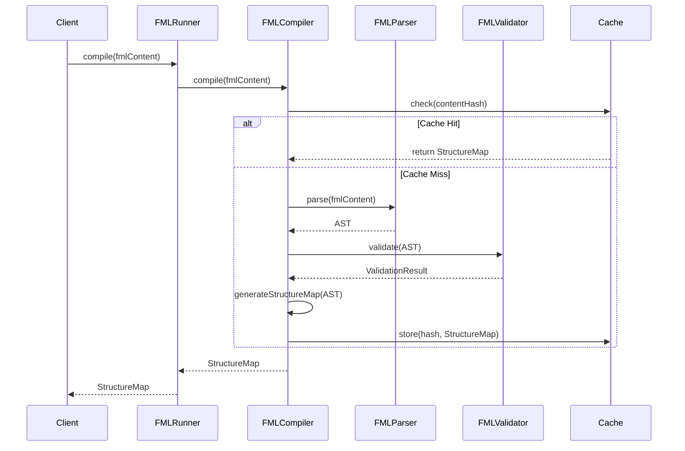
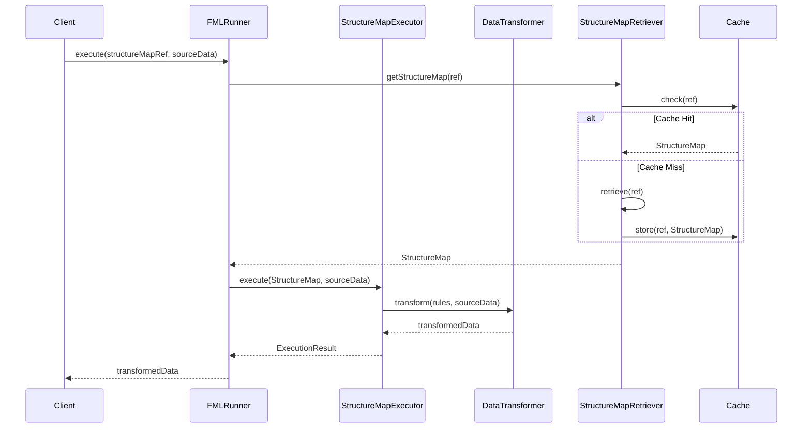

# Architecture Requirements

## 1. Overview

This document defines the architecture requirements for the FML Runner library, including system design, component organization, and integration patterns for microservice environments.

## 2. Architectural Principles

### 2.1 Design Principles (ARCH-001)

**Requirement:** The library SHALL adhere to the following architectural principles:

- **Separation of Concerns**: Clear separation between compilation, execution, and retrieval functionalities
- **Single Responsibility**: Each component has one clear responsibility
- **Dependency Inversion**: Depend on abstractions, not concrete implementations
- **Open/Closed Principle**: Open for extension, closed for modification
- **Interface Segregation**: Clients should not depend on interfaces they don't use
- **Don't Repeat Yourself (DRY)**: Avoid code duplication
- **SOLID Principles**: Follow all SOLID design principles

### 2.2 Library Design Philosophy (ARCH-002)

**Requirement:** The library SHALL be designed as a composable, reusable component.

**Design Characteristics:**
- Framework-agnostic: Can be integrated into any Node.js application
- Minimal dependencies: Reduce external dependency footprint
- Configurable: Support various deployment scenarios
- Testable: All components must be unit testable
- Observable: Provide monitoring and debugging capabilities

## 3. System Architecture

### 3.1 High-Level Architecture (ARCH-003)

**Requirement:** The system SHALL follow a layered architecture pattern.

```
┌─────────────────────────────────────────────────┐
│                Application Layer                 │
│  (Consumer Applications, Microservices, APIs)   │
└─────────────────────────────────────────────────┘
                          │
┌─────────────────────────────────────────────────┐
│                 API Layer                       │
│     (FMLRunner, Public Interfaces)             │
└─────────────────────────────────────────────────┘
                          │
┌─────────────────────────────────────────────────┐
│               Service Layer                     │
│  (FMLCompiler, StructureMapExecutor,           │
│   StructureMapRetriever)                       │
└─────────────────────────────────────────────────┘
                          │
┌─────────────────────────────────────────────────┐
│               Core Layer                        │
│  (Parsers, Validators, Transformers,           │
│   Cache, Error Handling)                       │
└─────────────────────────────────────────────────┘
                          │
┌─────────────────────────────────────────────────┐
│            Infrastructure Layer                 │
│  (File System, HTTP Client, Logging,           │
│   Configuration Management)                     │
└─────────────────────────────────────────────────┘
```

### 3.2 Component Architecture (ARCH-004)

**Requirement:** The system SHALL be organized into distinct, loosely-coupled components.

#### 3.2.1 Core Components

```typescript
interface ComponentArchitecture {
  // API Layer
  fmlRunner: FMLRunner;
  
  // Service Layer
  compiler: FMLCompiler;
  executor: StructureMapExecutor;
  retriever: StructureMapRetriever;
  
  // Core Layer
  parser: FMLParser;
  validator: FMLValidator;
  transformer: DataTransformer;
  cache: CacheManager;
  errorHandler: ErrorHandler;
  
  // Infrastructure Layer
  fileSystem: FileSystemAdapter;
  httpClient: HttpClientAdapter;
  logger: LoggerAdapter;
  configManager: ConfigurationManager;
}
```

#### 3.2.2 Component Dependencies



## 4. Design Patterns

### 4.1 Core Design Patterns (ARCH-005)

**Requirement:** The library SHALL implement appropriate design patterns for maintainability and extensibility.

#### 4.1.1 Factory Pattern
- Used for creating configured instances of main components
- Supports different deployment scenarios
- Enables dependency injection

#### 4.1.2 Strategy Pattern
- Multiple retrieval strategies (directory, URL, cache)
- Multiple validation strategies (strict, lenient)
- Multiple transformation strategies

#### 4.1.3 Observer Pattern
- Event-driven architecture for monitoring
- Extensible event system for custom handlers
- Performance monitoring and logging

#### 4.1.4 Adapter Pattern
- File system abstraction
- HTTP client abstraction
- Logger abstraction

#### 4.1.5 Repository Pattern
- StructureMap storage and retrieval
- Cache management
- Resource resolution

### 4.2 Dependency Injection (ARCH-006)

**Requirement:** The library SHALL support dependency injection for all major components.

```typescript
interface DependencyContainer {
  register<T>(token: string, implementation: T): void;
  registerSingleton<T>(token: string, factory: () => T): void;
  resolve<T>(token: string): T;
  createScope(): DependencyContainer;
}

// Usage example
const container = new DependencyContainer();
container.registerSingleton('logger', () => new ConsoleLogger());
container.registerSingleton('cache', () => new MemoryCache());
container.register('httpClient', new HttpClientAdapter());

const fmlRunner = container.resolve<FMLRunner>('fmlRunner');
```

## 5. Data Flow Architecture

### 5.1 Compilation Flow (ARCH-007)

**Requirement:** The compilation process SHALL follow a well-defined data flow.



### 5.2 Execution Flow (ARCH-008)

**Requirement:** The execution process SHALL follow a well-defined data flow.



## 6. Caching Architecture

### 6.1 Multi-Level Caching (ARCH-009)

**Requirement:** The system SHALL implement a multi-level caching strategy.

```typescript
interface CacheArchitecture {
  // L1 Cache: In-memory compiled StructureMaps
  compilationCache: Map<string, StructureMap>;
  
  // L2 Cache: Retrieved StructureMaps
  retrievalCache: Map<string, StructureMap>;
  
  // L3 Cache: Parsed FML ASTs
  parseCache: Map<string, AST>;
  
  // Cache Statistics
  stats: CacheStatistics;
  
  // Cache Policies
  evictionPolicy: EvictionPolicy;
  ttlPolicy: TTLPolicy;
}
```

### 6.2 Cache Invalidation Strategy (ARCH-010)

**Requirement:** The caching system SHALL implement intelligent cache invalidation.

- **Time-based expiration**: Configurable TTL for all cache entries
- **Size-based eviction**: LRU eviction when cache size limits are reached
- **Manual invalidation**: API endpoints for cache management
- **Version-based invalidation**: Automatic invalidation on StructureMap updates

## 7. Error Handling Architecture

### 7.1 Error Hierarchy (ARCH-011)

**Requirement:** The system SHALL implement a comprehensive error handling architecture.

```typescript
abstract class FMLRunnerError extends Error {
  abstract readonly type: ErrorType;
  abstract readonly code: string;
  readonly timestamp: Date;
  readonly details?: any;
  readonly sourceLocation?: SourceLocation;
  
  constructor(message: string, details?: any) {
    super(message);
    this.timestamp = new Date();
    this.details = details;
  }
}

class CompilationError extends FMLRunnerError {
  readonly type = ErrorType.COMPILATION_ERROR;
  constructor(code: string, message: string, location?: SourceLocation) {
    super(message);
    this.code = code;
    this.sourceLocation = location;
  }
}

class ExecutionError extends FMLRunnerError {
  readonly type = ErrorType.EXECUTION_ERROR;
  // Implementation details
}
```

### 7.2 Error Recovery Strategies (ARCH-012)

**Requirement:** The system SHALL implement appropriate error recovery mechanisms.

- **Graceful degradation**: Continue processing when non-critical errors occur
- **Retry mechanisms**: Automatic retry for transient failures
- **Circuit breaker**: Prevent cascading failures for external dependencies
- **Fallback strategies**: Alternative approaches when primary methods fail

## 8. Configuration Architecture

### 8.1 Configuration Management (ARCH-013)

**Requirement:** The system SHALL support flexible configuration management.

```typescript
interface ConfigurationArchitecture {
  // Configuration Sources (priority order)
  sources: {
    environmentVariables: EnvironmentConfig;
    configFiles: FileConfig[];
    programmaticConfig: ProgrammaticConfig;
    defaults: DefaultConfig;
  };
  
  // Configuration Sections
  sections: {
    cache: CacheConfig;
    network: NetworkConfig;
    security: SecurityConfig;
    logging: LoggingConfig;
    performance: PerformanceConfig;
  };
  
  // Configuration Validation
  validator: ConfigValidator;
  
  // Dynamic Reconfiguration
  watcher: ConfigWatcher;
}
```

### 8.2 Environment-Specific Configuration (ARCH-014)

**Requirement:** The system SHALL support different configuration profiles.

- **Development**: Enhanced logging, relaxed validation, local file system access
- **Testing**: Mock services, in-memory caching, deterministic behavior
- **Production**: Optimized performance, strict validation, remote resource access
- **Microservice**: Service discovery, health checks, metrics collection

## 9. Monitoring and Observability Architecture

### 9.1 Observability Components (ARCH-015)

**Requirement:** The system SHALL provide comprehensive observability features.

```typescript
interface ObservabilityArchitecture {
  // Metrics Collection
  metrics: {
    compilationMetrics: CompilationMetrics;
    executionMetrics: ExecutionMetrics;
    cacheMetrics: CacheMetrics;
    errorMetrics: ErrorMetrics;
  };
  
  // Distributed Tracing
  tracing: {
    tracer: OpenTelemetryTracer;
    spans: SpanManager;
    context: TraceContext;
  };
  
  // Structured Logging
  logging: {
    logger: StructuredLogger;
    correlation: CorrelationIdManager;
    levels: LogLevelManager;
  };
  
  // Health Monitoring
  health: {
    checks: HealthCheck[];
    status: HealthStatus;
    dependencies: DependencyHealth[];
  };
}
```

### 9.2 Performance Monitoring (ARCH-016)

**Requirement:** The system SHALL provide detailed performance monitoring capabilities.

- **Compilation performance**: Time to compile FML to StructureMap
- **Execution performance**: Time to execute transformations
- **Cache performance**: Hit rates, response times, eviction rates
- **Network performance**: Request/response times for remote retrievals
- **Memory usage**: Heap usage, garbage collection metrics

## 10. Security Architecture

### 10.1 Security Layers (ARCH-017)

**Requirement:** The system SHALL implement security at multiple architectural layers.

```typescript
interface SecurityArchitecture {
  // Input Validation Layer
  inputValidation: {
    sanitizer: InputSanitizer;
    validator: InputValidator;
    sizeLimit: SizeLimitEnforcer;
  };
  
  // Authentication Layer
  authentication: {
    providers: AuthenticationProvider[];
    tokenValidator: TokenValidator;
    sessionManager: SessionManager;
  };
  
  // Authorization Layer
  authorization: {
    rbac: RoleBasedAccessControl;
    policies: PolicyEngine;
    permissions: PermissionManager;
  };
  
  // Transport Security Layer
  transport: {
    tls: TLSConfiguration;
    certificates: CertificateManager;
    encryption: EncryptionManager;
  };
}
```

### 10.2 Secure Communication (ARCH-018)

**Requirement:** All external communication SHALL be secured appropriately.

- **HTTPS enforcement**: All HTTP communications must use TLS
- **Certificate validation**: Proper SSL/TLS certificate validation
- **Authentication tokens**: Secure handling of authentication credentials
- **Input sanitization**: All inputs must be validated and sanitized
- **Rate limiting**: Protection against DoS attacks

## 11. Scalability Architecture

### 11.1 Horizontal Scaling Support (ARCH-019)

**Requirement:** The library SHALL support deployment patterns that enable horizontal scaling.

- **Stateless design**: No server-side state dependencies
- **Distributed caching**: Support for Redis or similar distributed cache
- **Load balancing**: Compatible with standard load balancing strategies
- **Connection pooling**: Efficient resource utilization
- **Asynchronous processing**: Non-blocking operations where possible

### 11.2 Microservice Patterns (ARCH-020)

**Requirement:** The architecture SHALL support common microservice patterns.

- **Service discovery**: Integration with service discovery mechanisms
- **Circuit breaker**: Fault tolerance for external service dependencies
- **Bulkhead**: Isolation of different types of operations
- **Timeout handling**: Appropriate timeout configurations
- **Graceful shutdown**: Proper cleanup during service termination