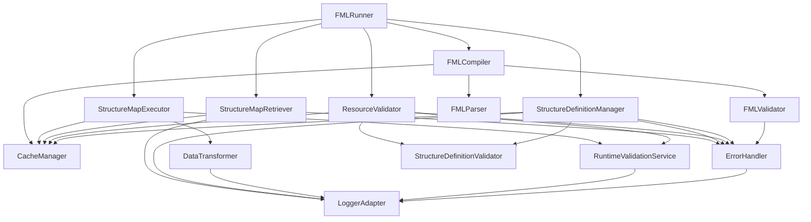
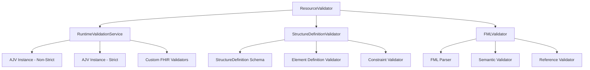
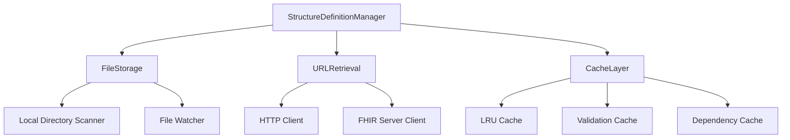
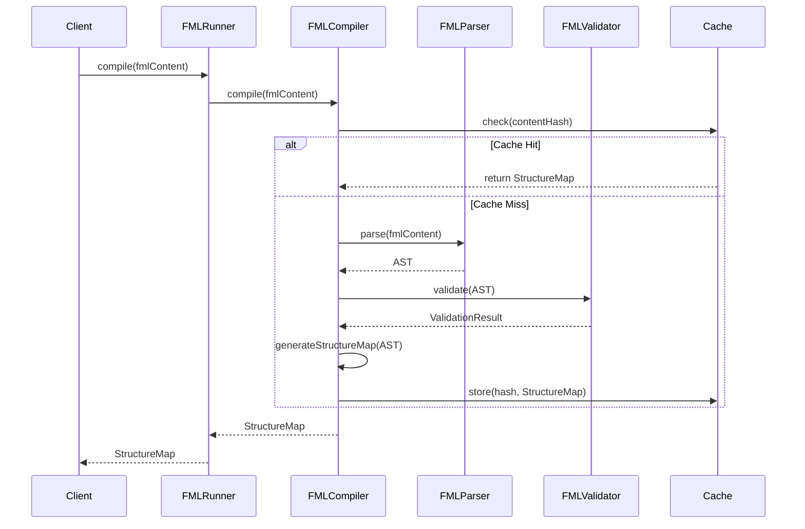
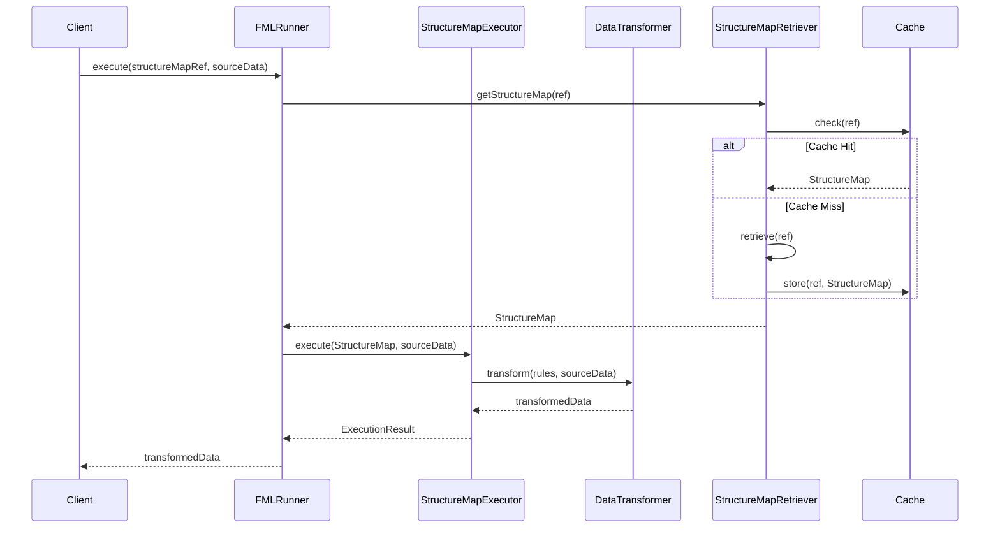
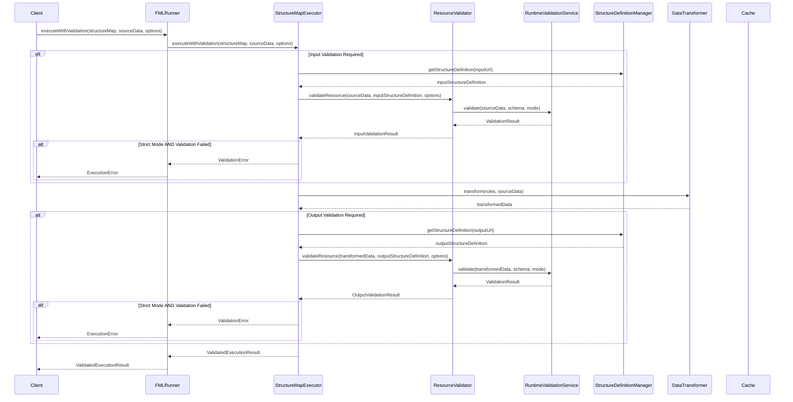
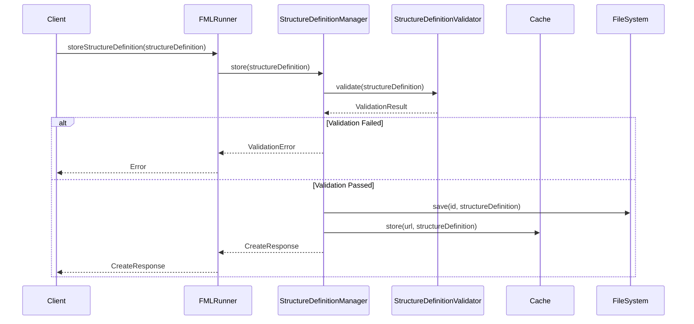

# Architecture Requirements

## 1. Overview

This document defines the architecture requirements for the FML Runner library, including system design, component organization, and integration patterns for microservice environments.

## 2. Architectural Principles

### 2.1 Design Principles (ARCH-001)

**Requirement:** The library SHALL adhere to the following architectural principles:

- **Separation of Concerns**: Clear separation between compilation, execution, and retrieval functionalities
- **Single Responsibility**: Each component has one clear responsibility
- **Dependency Inversion**: Depend on abstractions, not concrete implementations
- **Open/Closed Principle**: Open for extension, closed for modification
- **Interface Segregation**: Clients should not depend on interfaces they don't use
- **Don't Repeat Yourself (DRY)**: Avoid code duplication
- **SOLID Principles**: Follow all SOLID design principles

### 2.2 Library Design Philosophy (ARCH-002)

**Requirement:** The library SHALL be designed as a composable, reusable component.

**Design Characteristics:**
- Framework-agnostic: Can be integrated into any Node.js application
- Minimal dependencies: Reduce external dependency footprint
- Configurable: Support various deployment scenarios
- Testable: All components must be unit testable
- Observable: Provide monitoring and debugging capabilities

## 3. System Architecture

### 3.1 High-Level Architecture (ARCH-003)

**Requirement:** The system SHALL follow a layered architecture pattern.

```
┌─────────────────────────────────────────────────┐
│                Application Layer                 │
│  (Consumer Applications, Microservices, APIs)   │
└─────────────────────────────────────────────────┘
                          │
┌─────────────────────────────────────────────────┐
│                 API Layer                       │
│     (FMLRunner, Public Interfaces)             │
└─────────────────────────────────────────────────┘
                          │
┌─────────────────────────────────────────────────┐
│               Service Layer                     │
│  (FMLCompiler, StructureMapExecutor,           │
│   StructureMapRetriever, ResourceValidator,    │
│   StructureDefinitionManager)                  │
└─────────────────────────────────────────────────┘
                          │
┌─────────────────────────────────────────────────┐
│               Core Layer                        │
│  (Parsers, Validators, Transformers,           │
│   ValidationService, Cache, Error Handling)    │
└─────────────────────────────────────────────────┘
                          │
┌─────────────────────────────────────────────────┐
│            Infrastructure Layer                 │
│  (File System, HTTP Client, Logging,           │
│   Configuration Management)                     │
└─────────────────────────────────────────────────┘
```

### 3.2 Component Architecture (ARCH-004)

**Requirement:** The system SHALL be organized into distinct, loosely-coupled components.

#### 3.2.1 Core Components

```typescript
interface ComponentArchitecture {
  // API Layer
  fmlRunner: FMLRunner;
  
  // Service Layer
  compiler: FMLCompiler;
  executor: StructureMapExecutor;
  retriever: StructureMapRetriever;
  validator: ResourceValidator;
  structureDefinitionManager: StructureDefinitionManager;
  
  // Core Layer
  parser: FMLParser;
  fmlValidator: FMLValidator;
  structureDefinitionValidator: StructureDefinitionValidator;
  runtimeValidator: RuntimeValidationService;
  transformer: DataTransformer;
  cache: CacheManager;
  errorHandler: ErrorHandler;
  
  // Infrastructure Layer
  fileSystem: FileSystemAdapter;
  httpClient: HttpClientAdapter;
  logger: LoggerAdapter;
  configManager: ConfigurationManager;
}
```

#### 3.2.2 Component Dependencies



### 3.3 Validation Architecture (ARCH-005)

**Requirement:** The system SHALL implement a comprehensive validation architecture supporting multiple validation modes and contexts.

#### 3.3.1 Validation Service Hierarchy



#### 3.3.2 Execution Mode Architecture

The system supports two distinct execution modes with different architectural behaviors:

**Strict Mode:**
- Input validation blocks execution on errors
- Output validation fails the entire operation
- Immediate error propagation
- Transaction-like behavior (all-or-nothing)

**Non-Strict Mode:**
- Input validation warnings logged but execution continues
- Output validation warnings logged
- Accumulation of all validation issues
- Best-effort execution with detailed reporting

#### 3.3.3 Validation Context Management

```typescript
interface ValidationContext {
  mode: 'strict' | 'non-strict';
  structureDefinitions: Map<string, StructureDefinition>;
  errorCollector: ValidationErrorCollector;
  warningCollector: ValidationWarningCollector;
  stopOnError: boolean;
  maxErrors: number;
}
```

### 3.4 StructureDefinition Management Architecture (ARCH-006)

**Requirement:** The system SHALL provide a robust architecture for managing FHIR StructureDefinitions alongside StructureMaps.

#### 3.4.1 Storage Architecture



#### 3.4.2 CRUD Operation Architecture

All StructureDefinition operations follow FHIR RESTful patterns:

- **Create (POST)**: Server assigns ID, validates content, stores with metadata
- **Read (GET)**: Retrieves with optional metadata, supports caching
- **Update (PUT)**: Version-aware updates with change tracking
- **Delete (DELETE)**: Cascade handling for dependent resources
- **Search (GET with params)**: FHIR-compliant search with pagination

## 4. Design Patterns

### 4.1 Core Design Patterns (ARCH-007)

**Requirement:** The library SHALL implement appropriate design patterns for maintainability and extensibility.

#### 4.1.1 Factory Pattern
- Used for creating configured instances of main components
- Supports different deployment scenarios
- Enables dependency injection

#### 4.1.2 Strategy Pattern
- Multiple retrieval strategies (directory, URL, cache)
- Multiple validation strategies (strict, non-strict)
- Multiple transformation strategies
- Execution mode strategies

#### 4.1.3 Observer Pattern
- Event-driven architecture for monitoring
- Extensible event system for custom handlers
- Performance monitoring and logging
- Validation event propagation

#### 4.1.4 Adapter Pattern
- File system abstraction
- HTTP client abstraction
- Logger abstraction
- Validation service abstraction

#### 4.1.5 Repository Pattern
- StructureMap storage and retrieval
- StructureDefinition storage and retrieval
- Cache management
- Resource resolution

#### 4.1.6 Command Pattern
- Validation command pipeline
- Execution command with rollback capability
- Batch operation support

### 4.2 Dependency Injection (ARCH-008)

**Requirement:** The library SHALL support dependency injection for all major components.

```typescript
interface DependencyContainer {
  register<T>(token: string, implementation: T): void;
  registerSingleton<T>(token: string, factory: () => T): void;
  resolve<T>(token: string): T;
  createScope(): DependencyContainer;
}

// Usage example
const container = new DependencyContainer();
container.registerSingleton('logger', () => new ConsoleLogger());
container.registerSingleton('cache', () => new MemoryCache());
container.registerSingleton('runtimeValidator', () => new RuntimeValidationService());
container.register('httpClient', new HttpClientAdapter());
container.register('structureDefinitionManager', new StructureDefinitionManager());

const fmlRunner = container.resolve<FMLRunner>('fmlRunner');
```

## 5. Data Flow Architecture

### 5.1 Compilation Flow (ARCH-009)

**Requirement:** The compilation process SHALL follow a well-defined data flow.



### 5.2 Execution Flow (ARCH-010)

**Requirement:** The execution process SHALL follow a well-defined data flow.



### 5.3 Validated Execution Flow (ARCH-011)

**Requirement:** The validated execution process SHALL follow an enhanced data flow with input/output validation.



### 5.4 StructureDefinition Management Flow (ARCH-012)

**Requirement:** The StructureDefinition management SHALL follow FHIR-compliant operations.



## 6. Caching Architecture

### 6.1 Multi-Level Caching (ARCH-013)

**Requirement:** The system SHALL implement a multi-level caching strategy.

```typescript
interface CacheArchitecture {
  // L1 Cache: In-memory compiled StructureMaps
  compilationCache: Map<string, StructureMap>;
  
  // L2 Cache: Retrieved StructureMaps
  retrievalCache: Map<string, StructureMap>;
  
  // L3 Cache: Parsed FML ASTs
  parseCache: Map<string, AST>;
  
  // L4 Cache: StructureDefinitions
  structureDefinitionCache: Map<string, StructureDefinition>;
  
  // L5 Cache: Validation Results
  validationCache: Map<string, ValidationResult>;
  
  // Cache Statistics
  stats: CacheStatistics;
  
  // Cache Policies
  evictionPolicy: EvictionPolicy;
  ttlPolicy: TTLPolicy;
}
```

### 6.2 Cache Invalidation Strategy (ARCH-014)

**Requirement:** The caching system SHALL implement intelligent cache invalidation.

- **Time-based expiration**: Configurable TTL for all cache entries
- **Size-based eviction**: LRU eviction when cache size limits are reached
- **Manual invalidation**: API endpoints for cache management
- **Version-based invalidation**: Automatic invalidation on StructureMap updates
- **Dependency invalidation**: StructureDefinition changes invalidate dependent validation caches
- **Cascade invalidation**: Related resource updates trigger cascading cache invalidation

### 6.3 Validation Cache Strategy (ARCH-015)

**Requirement:** The system SHALL implement efficient caching for validation operations.

```typescript
interface ValidationCacheKey {
  resourceHash: string;
  structureDefinitionUrl: string;
  validationMode: 'strict' | 'non-strict';
  schemaVersion: string;
}

interface ValidationCacheEntry {
  result: ValidationResult;
  timestamp: Date;
  ttl: number;
  dependencies: string[]; // StructureDefinition URLs
}
```

**Cache Invalidation Rules:**
- Validation cache entries are invalidated when dependent StructureDefinitions change
- Hash-based invalidation for resource content changes
- Mode-specific caching (strict vs non-strict results cached separately)
- Schema version tracking for cache validity
- **Version-based invalidation**: Automatic invalidation on StructureMap updates

## 7. Error Handling Architecture

## 7. Error Handling Architecture

### 7.1 Error Hierarchy (ARCH-016)

**Requirement:** The system SHALL implement a comprehensive error handling architecture.

```typescript
abstract class FMLRunnerError extends Error {
  abstract readonly type: ErrorType;
  abstract readonly code: string;
  readonly timestamp: Date;
  readonly details?: any;
  readonly sourceLocation?: SourceLocation;
  
  constructor(message: string, details?: any) {
    super(message);
    this.timestamp = new Date();
    this.details = details;
  }
}

class CompilationError extends FMLRunnerError {
  readonly type = ErrorType.COMPILATION_ERROR;
  constructor(code: string, message: string, location?: SourceLocation) {
    super(message);
    this.code = code;
    this.sourceLocation = location;
  }
}

class ExecutionError extends FMLRunnerError {
  readonly type = ErrorType.EXECUTION_ERROR;
  readonly executionContext?: ExecutionContext;
  
  constructor(code: string, message: string, context?: ExecutionContext) {
    super(message);
    this.code = code;
    this.executionContext = context;
  }
}

class ValidationError extends FMLRunnerError {
  readonly type = ErrorType.VALIDATION_ERROR;
  readonly validationMode: 'strict' | 'non-strict';
  readonly path?: string;
  readonly expected?: any;
  readonly actual?: any;
  
  constructor(code: string, message: string, path?: string, mode: 'strict' | 'non-strict' = 'strict') {
    super(message);
    this.code = code;
    this.path = path;
    this.validationMode = mode;
  }
}

class StructureDefinitionError extends FMLRunnerError {
  readonly type = ErrorType.STRUCTURE_DEFINITION_ERROR;
  readonly structureDefinitionUrl?: string;
  
  constructor(code: string, message: string, url?: string) {
    super(message);
    this.code = code;
    this.structureDefinitionUrl = url;
  }
}

class RetrievalError extends FMLRunnerError {
  readonly type = ErrorType.RETRIEVAL_ERROR;
  readonly resourceUrl?: string;
  readonly httpStatus?: number;
  
  constructor(code: string, message: string, url?: string, status?: number) {
    super(message);
    this.code = code;
    this.resourceUrl = url;
    this.httpStatus = status;
  }
}

enum ErrorType {
  COMPILATION_ERROR = 'COMPILATION_ERROR',
  EXECUTION_ERROR = 'EXECUTION_ERROR',
  VALIDATION_ERROR = 'VALIDATION_ERROR',
  STRUCTURE_DEFINITION_ERROR = 'STRUCTURE_DEFINITION_ERROR',
  RETRIEVAL_ERROR = 'RETRIEVAL_ERROR',
  CONFIGURATION_ERROR = 'CONFIGURATION_ERROR',
  CACHE_ERROR = 'CACHE_ERROR'
}
```

### 7.2 Error Recovery Strategies (ARCH-017)

**Requirement:** The system SHALL implement appropriate error recovery mechanisms.

- **Graceful degradation**: Continue processing when non-critical errors occur
- **Retry mechanisms**: Automatic retry for transient failures (network, cache)
- **Circuit breaker**: Prevent cascading failures for external dependencies
- **Validation fallback**: Non-strict mode continues execution with warnings
- **Cache fallback**: Serve stale cache entries when retrieval fails
- **Default value injection**: Use default values when optional validation fails

### 7.3 Execution Mode Error Handling (ARCH-018)

**Requirement:** Error handling SHALL behave differently based on execution mode.

**Strict Mode Error Handling:**
- Input validation errors block execution immediately
- Output validation errors fail the entire operation
- All errors are propagated to the caller
- No partial results are returned

**Non-Strict Mode Error Handling:**
- Input validation errors are logged as warnings
- Output validation errors are logged as warnings
- Execution continues with best-effort processing
- Partial results are returned with validation status

```typescript
interface ErrorHandlingStrategy {
  handleValidationError(error: ValidationError, mode: 'strict' | 'non-strict'): void;
  handleExecutionError(error: ExecutionError): void;
  collectErrors(): FMLRunnerError[];
  shouldContinue(error: FMLRunnerError, mode: 'strict' | 'non-strict'): boolean;
}
```

## 8. Microservice Architecture Requirements

### 8.1 REST API Design (ARCH-019)

**Requirement:** When deployed as a microservice, the system SHALL expose FHIR-compliant REST APIs.

**API Design Principles:**
- Follow FHIR RESTful conventions for resource management
- Support standard HTTP methods (GET, POST, PUT, DELETE)
- Implement proper HTTP status codes and error responses
- Support FHIR search parameters for resource discovery
- Provide OpenAPI 3.0 specification for API documentation

### 8.2 Containerization Requirements (ARCH-020)

**Requirement:** The system SHALL support containerized deployment scenarios.

**Container Architecture:**
- Docker-based containerization with multi-stage builds
- Minimal base image for production deployment
- Configuration via environment variables
- Health check endpoints for container orchestration
- Proper signal handling for graceful shutdown
- Security best practices (non-root user, minimal attack surface)

```dockerfile
# Multi-stage Dockerfile example
FROM node:18-alpine AS builder
WORKDIR /app
COPY package*.json ./
RUN npm ci --only=production

FROM node:18-alpine AS runtime
RUN addgroup -g 1001 -S nodejs && adduser -S fmlrunner -u 1001
USER fmlrunner
WORKDIR /app
COPY --from=builder --chown=fmlrunner:nodejs /app/node_modules ./node_modules
COPY --chown=fmlrunner:nodejs . .
EXPOSE 3000
HEALTHCHECK --interval=30s --timeout=3s --start-period=5s --retries=3 \
  CMD node healthcheck.js
CMD ["node", "server.js"]
```

This completes the comprehensive architecture requirements for the FML Runner with logical model support and validation framework.
- **Fallback strategies**: Alternative approaches when primary methods fail

## 8. Configuration Architecture

### 8.1 Configuration Management (ARCH-013)

**Requirement:** The system SHALL support flexible configuration management.

```typescript
interface ConfigurationArchitecture {
  // Configuration Sources (priority order)
  sources: {
    environmentVariables: EnvironmentConfig;
    configFiles: FileConfig[];
    programmaticConfig: ProgrammaticConfig;
    defaults: DefaultConfig;
  };
  
  // Configuration Sections
  sections: {
    cache: CacheConfig;
    network: NetworkConfig;
    security: SecurityConfig;
    logging: LoggingConfig;
    performance: PerformanceConfig;
  };
  
  // Configuration Validation
  validator: ConfigValidator;
  
  // Dynamic Reconfiguration
  watcher: ConfigWatcher;
}
```

### 8.2 Environment-Specific Configuration (ARCH-014)

**Requirement:** The system SHALL support different configuration profiles.

- **Development**: Enhanced logging, relaxed validation, local file system access
- **Testing**: Mock services, in-memory caching, deterministic behavior
- **Production**: Optimized performance, strict validation, remote resource access
- **Microservice**: Service discovery, health checks, metrics collection

## 9. Monitoring and Observability Architecture

### 9.1 Observability Components (ARCH-015)

**Requirement:** The system SHALL provide comprehensive observability features.

```typescript
interface ObservabilityArchitecture {
  // Metrics Collection
  metrics: {
    compilationMetrics: CompilationMetrics;
    executionMetrics: ExecutionMetrics;
    cacheMetrics: CacheMetrics;
    errorMetrics: ErrorMetrics;
  };
  
  // Distributed Tracing
  tracing: {
    tracer: OpenTelemetryTracer;
    spans: SpanManager;
    context: TraceContext;
  };
  
  // Structured Logging
  logging: {
    logger: StructuredLogger;
    correlation: CorrelationIdManager;
    levels: LogLevelManager;
  };
  
  // Health Monitoring
  health: {
    checks: HealthCheck[];
    status: HealthStatus;
    dependencies: DependencyHealth[];
  };
}
```

### 9.2 Performance Monitoring (ARCH-016)

**Requirement:** The system SHALL provide detailed performance monitoring capabilities.

- **Compilation performance**: Time to compile FML to StructureMap
- **Execution performance**: Time to execute transformations
- **Cache performance**: Hit rates, response times, eviction rates
- **Network performance**: Request/response times for remote retrievals
- **Memory usage**: Heap usage, garbage collection metrics

## 10. Security Architecture

### 10.1 Security Layers (ARCH-017)

**Requirement:** The system SHALL implement security at multiple architectural layers.

```typescript
interface SecurityArchitecture {
  // Input Validation Layer
  inputValidation: {
    sanitizer: InputSanitizer;
    validator: InputValidator;
    sizeLimit: SizeLimitEnforcer;
  };
  
  // Transport Security Layer
  transport: {
    tls: TLSConfiguration;
    certificates: CertificateManager;
    encryption: EncryptionManager;
  };
}
```

### 10.2 Secure Communication (ARCH-018)

**Requirement:** All external communication SHALL be secured appropriately.

- **HTTPS enforcement**: All HTTP communications must use TLS
- **Certificate validation**: Proper SSL/TLS certificate validation
- **Input sanitization**: All inputs must be validated and sanitized
- **Rate limiting**: Protection against DoS attacks

## 11. Scalability Architecture

### 11.1 Horizontal Scaling Support (ARCH-019)

**Requirement:** The library SHALL support deployment patterns that enable horizontal scaling.

- **Stateless design**: No server-side state dependencies
- **Distributed caching**: Support for Redis or similar distributed cache
- **Load balancing**: Compatible with standard load balancing strategies
- **Connection pooling**: Efficient resource utilization
- **Asynchronous processing**: Non-blocking operations where possible

### 11.2 Microservice Patterns (ARCH-020)

**Requirement:** The architecture SHALL support common microservice patterns.

- **Service discovery**: Integration with service discovery mechanisms
- **Circuit breaker**: Fault tolerance for external service dependencies
- **Bulkhead**: Isolation of different types of operations
- **Timeout handling**: Appropriate timeout configurations
- **Graceful shutdown**: Proper cleanup during service termination