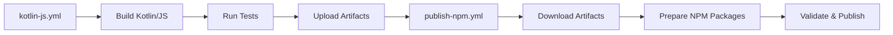

# Kotlin/JS and NPM Workflow Integration

This document describes the integration between the Kotlin multiplatform build and NPM publishing workflows for the FML Runner project.

## Overview

The FML Runner project now uses an integrated build system that:
1. Builds Kotlin/JS artifacts from the multiplatform codebase
2. Automatically packages these artifacts into NPM packages
3. Publishes the packages to the NPM registry with proper dependency management

## Workflow Architecture



### Primary Workflows

1. **kotlin-js.yml** - Kotlin Multiplatform Build
   - Builds JVM and JavaScript targets
   - Runs comprehensive test suites
   - Uploads JavaScript artifacts for NPM packaging
   - Can be triggered independently or called by other workflows

2. **publish-npm.yml** - NPM Publishing with Kotlin/JS Integration
   - Depends on successful Kotlin/JS build
   - Downloads and prepares Kotlin/JS artifacts
   - Validates package contents
   - Publishes to NPM registry

## Key Integration Points

### 1. Workflow Dependencies

```yaml
jobs:
  build-kotlin:
    uses: ./.github/workflows/kotlin-js.yml
    
  publish:
    runs-on: ubuntu-latest
    needs: build-kotlin
```

The NPM publish workflow now depends on the Kotlin build, ensuring JavaScript artifacts are always fresh.

### 2. Artifact Management

```yaml
- name: Download Kotlin/JS artifacts
  uses: actions/download-artifact@v4
  with:
    name: kotlin-js-build
    path: build/
```

Kotlin/JS build outputs are automatically downloaded and made available for NPM packaging.

### 3. Package Preparation

```yaml
- name: Prepare Kotlin/JS artifacts for NPM
  run: |
    mkdir -p packages/fmlrunner/dist
    cp build/dist/js/productionExecutable/fmlrunner.js packages/fmlrunner/dist/
```

The workflow automatically copies Kotlin-generated JavaScript files to the appropriate NPM package directories.

## Package Structure

### Core Package (packages/fmlrunner/)

```
packages/fmlrunner/
├── package.json          # NPM package configuration
├── README.md            # Package documentation
├── fmlrunner.d.ts       # TypeScript definitions
└── dist/                # Kotlin/JS artifacts (created during build)
    ├── fmlrunner.js     # Main JavaScript bundle
    └── fmlrunner.js.map # Source map for debugging
```

### Version Management

The project includes a unified version management system:

```bash
# View current version
npm run version:current

# Bump versions across all packages
npm run version:patch    # 0.1.0 → 0.1.1
npm run version:minor    # 0.1.0 → 0.2.0
npm run version:major    # 0.1.0 → 1.0.0

# Test publishing
npm run publish:dry-run

# Publish all packages
npm run publish:all
```

## Benefits of Integration

1. **Consistency**: NPM packages always contain the latest Kotlin/JS code
2. **Automation**: No manual steps required to sync builds
3. **Quality Assurance**: Both Kotlin and NPM tests must pass before publishing
4. **Type Safety**: TypeScript definitions provide excellent developer experience
5. **Cross-Platform**: Single codebase targets both JVM and JavaScript platforms

## Developer Workflow

For developers working on the project:

1. **Development**: Write Kotlin code in `src/commonMain/kotlin/`
2. **Testing**: Run `gradle test` for comprehensive testing
3. **Building**: Run `gradle build` to generate all artifacts
4. **Publishing**: Use GitHub Actions workflow for NPM publishing

The integration ensures that any changes to the Kotlin codebase are automatically reflected in the published NPM packages, maintaining consistency across all distribution channels.

## Future Enhancements

The current integration provides a solid foundation for:
- Additional NPM packages (fmlrunner-rest, fmlrunner-mcp, fmlrunner-web)
- Enhanced TypeScript definitions generated from Kotlin
- Automated semantic versioning based on commit messages
- Integration testing between Kotlin/JS and TypeScript codebases